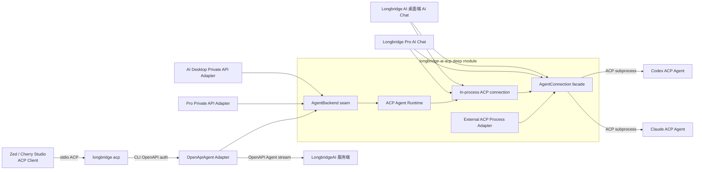
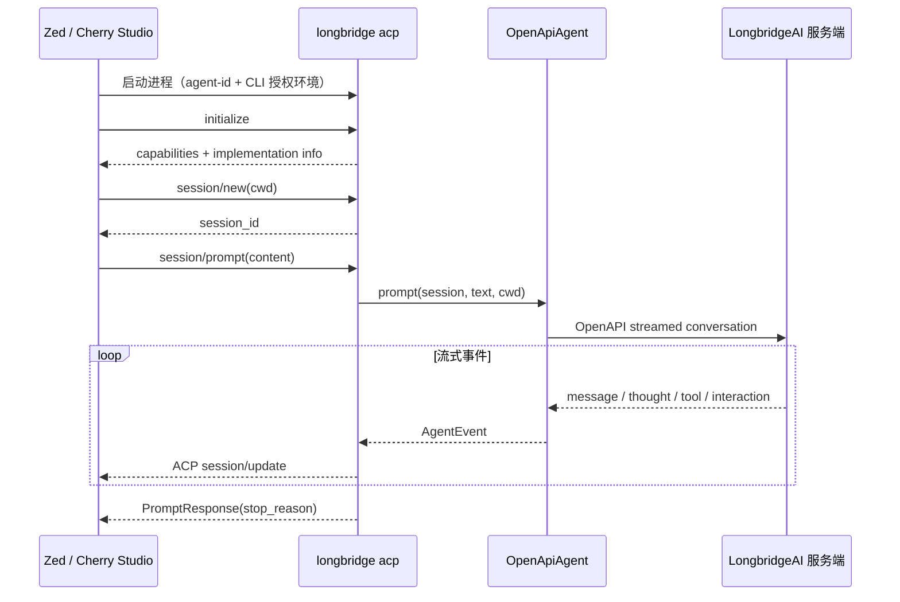
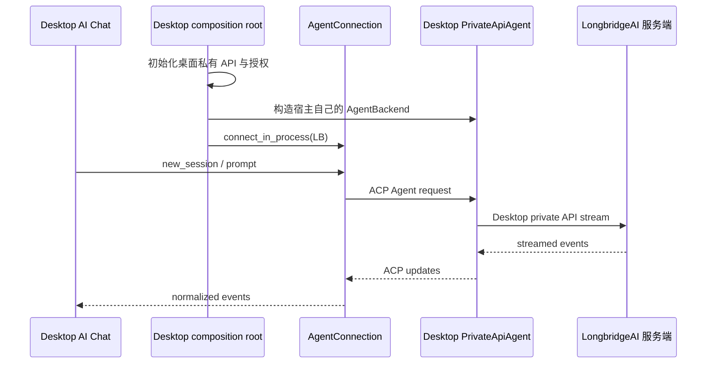
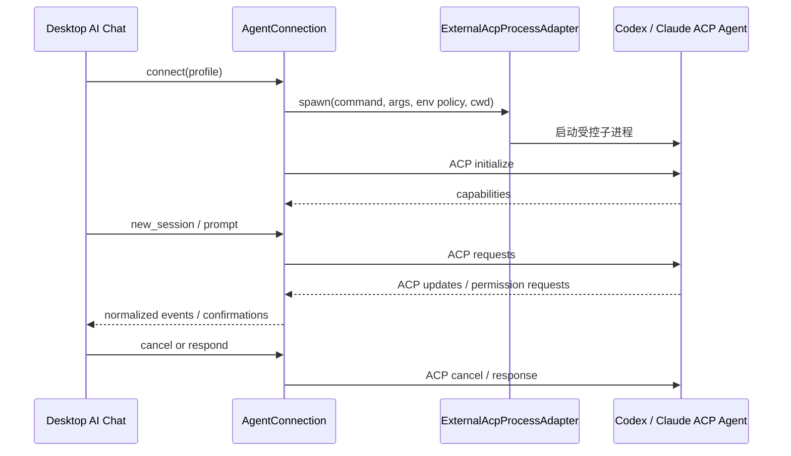

# Longbridge AI 的 ACP 接入架构规划

> 会议介绍版：[打开交互式架构网页](./acp-integration.html)

> 状态：架构规划记录（As-is / To-be）  
> 适用范围：`longbridge-terminal`、Longbridge Pro、Longbridge AI 桌面端  
> 核心决策：以 ACP 作为 Agent 与宿主之间的统一协议；CLI 对外提供 stdio ACP，桌面产品通过 Rust crate 进程内复用 LongbridgeAI 能力，并作为 ACP Client 接入外部 Agent。

## 1. 背景与目标

Longbridge OpenAPI 已提供 LongbridgeAI Agent 能力。我们希望把它收敛为一个可复用的 ACP 模块，使同一套 Agent 语义能够服务三类调用方：

1. `longbridge` CLI 通过 stdio 暴露 ACP，供 Zed、Cherry Studio 等 ACP Client 启动和连接。
2. Longbridge Pro、Longbridge AI 桌面端直接链接 Rust crate，在自身进程内接入 LongbridgeAI；桌面端不启动、调度或嵌入 CLI 进程。
3. 桌面端 AI Chat 作为 ACP Client，通过外部进程 Adapter 接入 Codex、Claude 等第三方 ACP Agent。

兼容性基线：Zed 当前提供标准 ACP External Agent/自定义 Agent 入口，可直接验证；Cherry Studio 是目标客户端，但截至本规划核对时，其公开文档只有 MCP 配置面，尚未公开 ACP 自定义 Agent 入口，因此不能把 ACP server 误配成 MCP server。Cherry 的验收要等待其 ACP Client 能力或明确的扩展入口。

由此，AI Chat 面向的是统一的 ACP 会话和事件模型，而不是每一种 Agent 的私有流式协议。

### 1.1 设计目标

- 对外兼容标准 ACP，不向 Zed、Cherry Studio 等客户端暴露 Longbridge 私有协议。
- `longbridge-ai-acp` 成为 deep module：用较小、稳定的 Interface 隐藏 ACP 协议运行时、会话管理、人工交互和后端事件映射的复杂度。
- CLI 和桌面产品复用同一 ACP runtime 与 `AgentBackend` seam，但不复用 API Adapter：CLI 使用 OpenAPI Adapter，桌面产品使用各自私有 API Adapter。
- 桌面 AI Chat 只依赖 ACP Client Interface，能够在 LongbridgeAI、Codex、Claude 等 Agent 之间切换。
- 明确取消、错误、恢复、进程生命周期和敏感信息的处理规则。
- Interface 同时作为生产调用与测试的 seam，避免业务逻辑散落在 CLI 和多个桌面产品中。

### 1.2 非目标

- 不用 CLI 进程作为 Longbridge 桌面产品接入 LongbridgeAI 的必经路径。
- 不统一 CLI 与桌面端的登录、token storage 或 OAuth 页面；它们的授权域必须隔离。
- 不在本阶段实现通用 Agent 编排、multi-agent 调度、模型路由或跨 Agent 共享记忆。
- 不把 Codex、Claude 的私有协议直接加入 AI Chat；它们应由各自 ACP Agent/Adapter 接入。
- 不承诺所有 ACP 可选 capability 一次性完成。capability 必须按真实支持情况协商。
- 不在本文固定服务端尚未稳定的私有字段；这些字段应留在 LongbridgeAI Adapter 内部。

## 2. As-is 与 To-be

### 2.1 As-is（当前 worktree 已有事实）

- workspace 已包含 `crates/longbridge-ai-acp`。
- crate 只提供 provider-neutral 的 `AgentBackend` seam、ACP client/server runtime 与会话 actor，不依赖 OpenAPI 或任何桌面私有 API。
- CLI 专属 `OpenApiAgent` Adapter 位于 `longbridge-terminal` 主包；它不属于可复用 ACP crate。
- 桌面产品必须在各自仓库实现私有 API Adapter；API 地址、请求类型、凭证与授权刷新不进入 ACP crate。
- crate 已能把 LongbridgeAI 的文本、思考、工具开始/结束、人工补充信息和完成事件映射为内部 `AgentEvent`，并将其转换为 ACP session update。
- `acp_agent` 可在进程内构造 ACP Agent，`serve_stdio` 可通过 stdin/stdout 提供 ACP JSON-RPC。
- CLI 已有 `longbridge acp --agent-id <ID>`，也可通过 `LONGBRIDGE_AGENT_ID` 提供 Agent ID；该命令使用 CLI 自己的 OpenAPI 初始化与授权。
- crate 重新导出官方 ACP SDK，并以 `ExternalAgent` / `ExternalAgentConfig` 类型别名提供外部 ACP 子进程的底层入口。
- 当前会话状态保存在进程内；已处理 ACP 回合取消并通过丢弃宿主 backend stream 停止请求，Client helper 也会暴露协商后的 capability 与实现信息；但尚无服务端显式 cancel endpoint 或持久化恢复。
- crate 已提供 `with_session`（进程内 LongbridgeAI）和 `with_external_session`（外部 ACP 进程）的持久会话 helper，并通过 `ClientDelegate` 把 permission request 交回宿主；文件与 terminal 等完整桌面 capability facade 仍属于 To-be。
- crate 还提供后台驱动的 `DesktopSession`：它持有 ACP connection/外部子进程，向 GPUI 或 Tauri 暴露 `prompt`、`cancel`、`shutdown` 命令与 `SessionUpdate`、`TurnFinished`、`Failed` 事件；控制 handle 与独占 event stream 可拆分，避免 UI 等待流式事件时阻塞 Stop。已覆盖多轮会话、重叠 prompt 拒绝、取消以及真实 stdio 子进程关闭。
- `longbridge-gpui` 的 `ai_agent` 已实现宿主私有 Babbage API 的 `AgentBackend`，`ai_panel` 已提供 LongbridgeAI ACP、Codex、Claude provider 入口，并把 ACP 文本、思考、工具和完成事件接入现有消息 UI。Codex 与 Claude 官方 Adapter 的真实 ACP V1 initialize 已通过；权限确认、附件与发布级 Adapter 分发仍需补齐。
- `ai-desktop` 的 Tauri Rust 壳已提供托管的 Codex/Claude ACP session bridge（connect/prompt/cancel/disconnect + event stream）；React Chat 的 provider picker 与消息模型接线仍属于下一步。私有 Longbridge API 继续由现有 renderer bridge 持有，不会被下沉到 ACP crate。

### 2.2 To-be（目标状态）

- `longbridge-ai-acp` 提供稳定的 Agent-side 与 Client-side Interface，桌面 AI Chat 不需要直接理解 ACP SDK 的底层连接细节。
- CLI 的 stdio ACP 可被至少一个真实第三方 ACP Client 验证；stdout 严格保留给协议帧。
- Longbridge Pro 与 Longbridge AI 桌面端将各自私有 API Adapter 注入进程内 ACP runtime。
- 桌面 AI Chat 通过同一个 client facade 消费进程内 LongbridgeAI 和外部 Codex/Claude ACP Agent 的标准化事件。
- 取消信号贯穿 UI → ACP connection → backend request；会话可按明确策略恢复或宣告不可恢复。
- capability、错误类别、交互请求和工具事件均有一致的产品语义与兼容测试。

## 3. 术语与角色

- **Module**：具有一个 Interface 和对应 Implementation 的代码单元。本架构中的核心 Module 是 `longbridge-ai-acp`。
- **Interface**：调用者正确使用 Module 所需知道的全部事实，包括类型、约束、事件顺序、错误、取消和生命周期。
- **Seam**：不修改调用点即可替换行为的位置。核心 seam 是 `AgentBackend`、ACP transport，以及桌面端的 `AgentConnection` facade。
- **Adapter**：在 seam 上满足 Interface 的宿主实现，例如 CLI `OpenApiAgent`、桌面私有 API Adapter、Codex ACP subprocess Adapter。
- **ACP Agent**：实现 ACP Agent 一侧协议、接收 session/prompt 请求并产生更新的一方。
- **ACP Client**：创建连接、发送请求、消费 session update 和处理 capability 的一方。
- **宿主**：拥有进程、配置、授权和 UI 生命周期的产品；包括 CLI、Longbridge Pro 和 Longbridge AI 桌面端。
- **LongbridgeAI 服务端**：由 OpenAPI Agent 能力访问的远端系统。
- **外部 ACP Agent**：由桌面宿主启动或连接的 Codex、Claude 等 ACP 实现。

## 4. 上下文与信任边界

### 4.1 授权域

| 上下文 | Agent 运行位置 | 凭证所有者 | API 地址来源 | Transport |
| --- | --- | --- | --- | --- |
| Zed / Cherry Studio → CLI | `longbridge` 子进程 | CLI/OpenAPI 专属授权 | CLI 配置或受控参数 | stdio ACP |
| Longbridge Pro → LongbridgeAI | 桌面进程内 | Longbridge Pro | 宿主注入 | 进程内连接 |
| Longbridge AI 桌面端 → LongbridgeAI | 桌面进程内 | Longbridge AI 桌面端 | 宿主注入 | 进程内连接 |
| 桌面 AI Chat → Codex/Claude | 外部 Agent 进程或其支持的 transport | 外部 Agent/宿主约定 | 外部 Agent 配置 | ACP |

关键不变量：

- `longbridge-ai-acp` 不主动读取任何产品的全局 credential storage。
- ACP crate 不接收、解析或存储任何 API config；每个宿主 Adapter 自己拥有 endpoint 与授权。
- API 地址必须由宿主显式提供或由宿主已配置的 `Config` 携带，不能在 crate 内隐式覆盖。
- CLI 的凭证不可被桌面产品自动继承；桌面凭证也不可写入 CLI storage。
- 外部 ACP Agent 是独立信任域。其可执行文件、参数、环境变量、工作目录和权限都由桌面宿主进行 allowlist 与用户确认。

### 4.2 数据与进程信任边界

- stdio 上只允许 ACP JSON-RPC；日志、进度和诊断必须写入 stderr 或结构化 telemetry，避免破坏协议流。
- prompt、工具输入输出、思考内容可能包含敏感投资或账户上下文。默认不写入普通日志；调试日志必须脱敏并由用户显式开启。
- `cwd`、文件和终端能力属于高权限能力。仅在 Agent capability 与用户授权同时满足时开放。
- 进程内接入消除了子进程边界，但没有消除授权边界：桌面宿主仍然负责限制传给 Agent 的上下文和能力。

## 5. 模块划分与 seam

### 5.1 `longbridge-ai-acp` 核心 Module

该 crate 应隐藏以下 Implementation 细节：

- Longbridge OpenAPI Agent 请求与流式响应解析；
- 服务端 conversation/message 标识与 ACP session 标识之间的关联；
- Longbridge 私有事件到 ACP update 的映射；
- 人工补充信息后的续跑；
- transport 生命周期、错误归类和取消传播；
- 外部 ACP Agent 的进程管理与 ACP Client 连接。

建议对外保持三个小 Interface：

1. `AgentBackend`：provider-neutral 的 Agent 执行 seam。
2. `AcpAgentRuntime`：把任意 `AgentBackend` 暴露为进程内或 stdio ACP Agent。
3. `AgentConnection`：桌面 AI Chat 使用的高层 ACP Client seam，屏蔽官方 SDK 与子进程细节。

### 5.2 Adapter

- `OpenApiAgent`：CLI 内部将 LongbridgeAI OpenAPI 实现为 `AgentBackend`。
- `PrivateApiAgent`：由每个桌面宿主将其私有 API 实现为 `AgentBackend`，不属于本 crate。
- `InProcessAcpAdapter`：在同一 Rust 进程中连接 ACP Client 与 `AgentBackend`，供桌面产品使用。
- `StdioAcpServerAdapter`：把 `AgentBackend` 暴露为 stdio ACP，供 CLI 使用。
- `ExternalAcpProcessAdapter`：启动并连接 Codex/Claude 等外部 ACP Agent。
- `FakeAgentBackend` / `ScriptedAcpAgent`：测试 Adapter，用确定事件脚本验证所有调用方。

不要把某个产品的 API 映射塞进 ACP runtime。CLI OpenAPI 与桌面私有 API 本来就是不同接口；它们只在 `AgentBackend` 事件语义处收敛。

## 6. 组件关系



图中的 `AgentConnection` 已由 `DesktopSession`、可克隆控制 handle、独占 event stream，以及 `longbridge-gpui::ai_agent::acp::ChatAgent`/`ChatUpdate` 分层落地。完整产品级能力仍需补齐权限确认、附件、Adapter 安装发现和崩溃恢复。

## 7. 主要时序

### 7.1 第三方客户端通过 CLI 使用 LongbridgeAI



### 7.2 桌面端进程内使用 LongbridgeAI



此路径不启动 `longbridge` CLI。进程内 transport 仍走同一 ACP 语义，以避免 AI Chat 分叉出 LongbridgeAI 私有接入逻辑。

### 7.3 桌面端使用 Codex/Claude



## 8. 会话与事件映射

### 8.1 会话模型

当前 `AgentSession` 保存：

- `conversation_id`：LongbridgeAI 会话标识；
- `parent_message_id`：下一次续接所需的父消息标识；
- `pending_interaction`：等待用户回答的工具调用和问题。

ACP `session_id` 由 ACP Agent Runtime 分配，映射到 `(cwd, AgentSession)`。To-be 应把状态存储抽为内部 seam，以便提供内存 Adapter 和可选持久化 Adapter；持久化格式必须版本化，且不得默认保存敏感正文。

### 8.2 事件映射表

| LongbridgeAI / Backend 事件 | ACP 表达 | AI Chat 表达 | 备注 |
| --- | --- | --- | --- |
| `Text` | `AgentMessageChunk` | 助手正文增量 | 保序、不可重复 |
| `Thought` | `AgentThoughtChunk` | 可折叠思考增量 | UI 应允许隐藏；日志默认不记录 |
| `ToolStarted` | `ToolCall(InProgress)` | 工具卡片开始 | 保留稳定 tool call id |
| `ToolFinished(success)` | `ToolCallUpdate(Completed/Failed)` | 工具卡片完成/失败 | 原始输入输出按敏感策略展示 |
| `NeedsInput` | 当前为助手消息提示 | 结构化交互请求 | To-be 优先映射 ACP 原生交互能力；降级为文本需声明 |
| `Finished` | prompt response + stop reason | 回合完成 | 提交最新续接状态后再结束 |
| Backend error | ACP JSON-RPC error / failed update | 可恢复或终止错误 | 需要稳定错误分类 |

事件不变量：

- 同一 session 内保持服务端事件顺序。
- 工具完成事件必须引用已开始的 tool call；若服务端乱序，Adapter 负责缓冲或发出协议错误。
- `Finished` 之后不得再发送该回合的 chunk。
- `NeedsInput` 必须先保存续接状态，再通知客户端，避免 UI 回答到达时状态丢失。
- 非文本 prompt block 不应静默丢失。As-is 支持文本与 resource link，其他未声明内容返回参数错误；新增内容类型必须先协商 capability。

## 9. 授权与安全设计

### 9.1 宿主注入

推荐的 seam 不是“让 crate 去登录或拿到连接配置”，而是“让宿主实现行为接口”：

```rust,ignore
impl AgentBackend for DesktopPrivateApiAgent {
    type Session = DesktopPrivateSession;
    // prompt() 内部使用桌面私有 API client 与授权。
}
```

ACP crate 看不到 API 地址、token、OAuth 对象或私有请求类型。endpoint 校验、刷新与吊销全部由宿主 Adapter 负责。

### 9.2 安全要求

- 禁止在命令行参数中直接传递 access token，避免 shell history 和进程列表泄漏。
- CLI 仅复用 CLI 自己的安全存储与 OpenAPI 专属授权流程。
- 桌面端 token 只存在于桌面授权域，由宿主决定刷新和吊销。
- 每个宿主 Adapter 必须校验自己的 API endpoint；生产构建默认只允许 TLS，开发环境的明文 endpoint 需显式开关。
- 外部 Agent executable 使用绝对路径或可信发现机制；参数不经 shell 拼接。
- 环境变量采用 allowlist 注入，不能无条件继承宿主全部环境。
- 对文件、terminal、tool permission 请求进行逐项授权，并向用户展示发起 Agent、目标和范围。
- 记录安全审计元数据时使用 session correlation id，不记录 token 和完整 prompt/tool payload。

## 10. 错误、取消与恢复

### 10.1 错误分类

To-be 的稳定错误类型至少区分：

- `Authentication`：未登录、token 过期、权限不足；由宿主触发自己的重新授权流程。
- `Configuration`：API 地址、Agent ID、外部命令或 capability 配置无效。
- `Transport`：stdio 断开、子进程退出、网络中断。
- `Protocol`：ACP 帧无效、事件顺序错误、版本或内容类型不支持。
- `Backend`：LongbridgeAI 或外部 Agent 返回失败。
- `Cancelled`：用户主动取消或宿主生命周期结束。
- `RecoverableInteraction`：需要回答、确认或授权后才能继续。

错误应保留 machine-readable code、可展示消息、source chain 和 retryability，UI 不应通过字符串匹配决定行为。

### 10.2 取消

- 每个 prompt 都应绑定 cancellation token。
- 收到 ACP cancel 后停止读取/转发新事件，并尽力取消远端 HTTP stream。
- 外部 Agent 未在超时内响应取消时，先发送优雅终止，再按策略结束子进程。
- 取消是回合级行为，不应默认删除 session；下一次 prompt 是否允许继续由 Backend 状态决定。
- As-is 已将 `session/cancel` 映射为 `StopReason::Cancelled` 并停止消费当前 stream；由于 LongbridgeAI 尚未暴露显式 cancel endpoint，这属于“断开请求/停止转发”，不能宣称服务端工作流一定同步停止。

### 10.3 恢复

- 短暂网络错误：只有在服务端操作具备幂等/游标语义时才能自动重试，否则向用户暴露“状态未知”。
- ACP Client 重连：内存 session 仅在 Agent 进程仍存活时可恢复。
- CLI 子进程退出：As-is 会话状态丢失；若未来支持跨进程恢复，应由版本化 session store 保存最小续接标识。
- 人工交互：Backend 在自己的关联 `Session` 类型中保存所需续接状态后再结束当前回合；ACP runtime 不理解这些私有字段。
- 外部 Agent 崩溃：保留 UI 消息历史，但只有对方声明 load/resume capability 时才恢复 Agent 内部会话。

## 11. Rust crate Interface 草图

以下为 To-be 方向，不代表当前代码均已实现：

```rust,ignore
pub trait AgentBackend: Send + Sync + 'static {
    type Session: Clone + Default + Send + Sync + 'static;

    async fn prompt(
        &self,
        session: Self::Session,
        prompt: AgentPrompt,
        context: PromptContext,
        cancel: CancellationToken,
    ) -> Result<AgentEventStream, AgentError>;
}

pub struct AcpAgentRuntime<B> { /* hidden */ }

impl<B: AgentBackend> AcpAgentRuntime<B> {
    pub fn in_process(backend: B) -> Self;
    pub async fn serve_stdio(self) -> Result<(), AgentError>;
}

pub trait AgentConnection: Send + Sync {
    async fn capabilities(&self) -> Result<AgentCapabilities, AgentError>;
    async fn new_session(&self, options: SessionOptions) -> Result<SessionHandle, AgentError>;
    async fn prompt(
        &self,
        session: &SessionHandle,
        prompt: AgentPrompt,
        cancel: CancellationToken,
    ) -> Result<AgentEventStream, AgentError>;
    async fn respond(&self, request: InteractionId, response: InteractionResponse)
        -> Result<(), AgentError>;
}

pub enum AgentTarget {
    InProcess(Box<dyn AgentBackendFactory>),
    ExternalAcp(ExternalAgentOptions),
}

pub async fn connect(target: AgentTarget) -> Result<Arc<dyn AgentConnection>, AgentError>;
```

设计约束：

- `AgentPrompt` 应保存 ACP content block，而不是预先压平为字符串。
- `AgentEventStream` 负责 backpressure；不得无界缓存完整回答。
- `SessionHandle` 对 UI 是 opaque，避免泄露 Longbridge 私有 conversation/message ID。
- 外部 Agent 的 spawn、initialize、shutdown 位于 `ExternalAcpProcessAdapter` 内，不散落到 UI。
- 若进程内路径能直接复用官方 ACP `connect_with`，优先复用，保证测试和外部协议行为一致。

## 12. CLI UX

### 12.1 当前命令

```text
longbridge acp --agent-id <AGENT_ID>
```

`agent-id` 也可由 `LONGBRIDGE_AGENT_ID` 提供。CLI 启动后在 stdin/stdout 上运行 ACP，使用 CLI 自己初始化的 OpenAPI context。

### 12.2 规划约束

- 缺少 Agent ID 时在协议启动前以非零状态退出，并把诊断写到 stderr。
- stdout 只写 ACP 帧；帮助、日志和认证诊断不得混入 stdout。
- API endpoint 若开放命令参数，优先使用 `--api-url` 或 CLI 配置，不接受隐式跨产品配置；其优先级需固定并文档化。
- `--agent-id`、CLI 配置与环境变量的优先级应可预测，推荐：显式参数 > 环境变量 > CLI 配置。
- ACP 客户端配置示例应只包含可执行文件、`acp` 子命令、Agent ID 来源和必要环境，不携带明文 token。
- `longbridge acp` 是面向机器的长期运行模式；不渲染 TUI，不自动升级，不输出营销信息。
- 初始化响应只宣告真实实现的 capability；新增能力通过兼容的 capability negotiation 演进。

## 13. 演进阶段

### 阶段 0：当前基线固化

- 为现有 `AgentBackend`、CLI `OpenApiAgent`、stdio server 和事件映射补齐架构契约测试。
- 验证 stdout purity、CLI 授权隔离和显式 endpoint 注入。
- 写明当前不支持的 ACP capability 与恢复限制。

### 阶段 1：CLI ACP 可用性

- 与至少一个真实第三方 ACP Client 完成 initialize、new session、prompt、streaming 的端到端验证。
- 完成人工交互、工具事件、取消和结构化错误映射。
- 提供 Zed 的最小配置示例和兼容矩阵；持续跟踪并验证 Cherry Studio 的 ACP Client 入口，不能以 MCP 配置替代。

### 阶段 2：桌面端进程内 LongbridgeAI

- 实现 `AgentConnection` facade 与进程内 Adapter。
- Longbridge Pro、Longbridge AI 桌面端从各自组合根注入 config、API endpoint 和 Agent ID。
- AI Chat 仅消费标准化 ACP capability/session/event，不依赖 Longbridge 私有事件。

### 阶段 3：外部 Codex/Claude ACP Agent

- 完成受控子进程生命周期、环境 allowlist、permission request、取消和崩溃处理。
- 分别对真实 Codex 与 Claude ACP 实现做 capability 探测与端到端测试。
- AI Chat 根据 capability 渲染文件、terminal、tool、thought 和交互 UI；不假设各 Agent 能力相同。

### 阶段 4：可靠性与产品化

- 按实际产品需求增加版本化 session store、telemetry、兼容矩阵和灰度开关。
- 建立协议兼容 CI，覆盖 ACP SDK 升级和外部 Agent 版本变更。
- 评估网络 transport；在没有明确跨设备需求前不扩大 transport surface。

## 14. 测试与验收

### 14.1 Module 级

- 使用 scripted backend 验证每一种 `AgentEvent` 到 ACP update 的映射与顺序。
- 验证多 session 并发隔离、同 session 的并发 prompt 策略和 backpressure。
- 验证人工交互状态先保存后通知，以及回答后的正确续接。
- 验证文本、非文本 content block、空 prompt 和超大事件的行为。
- 验证认证、transport、protocol、backend、cancelled 错误分类。
- 验证取消后不再输出事件，并释放网络 stream/子进程资源。

### 14.2 CLI 级

- `longbridge acp --help`、缺少 Agent ID、环境变量回退和 endpoint 优先级测试。
- 以真实 stdin/stdout 管道完成 initialize → new session → prompt → response。
- 在 stderr 产生诊断时，stdout 仍可被严格 JSON-RPC parser 读取。
- CLI credential storage 与桌面测试 credential 完全隔离。
- 使用测试 endpoint 证明请求发往宿主/CLI 指定地址，而非 crate 内默认地址。

### 14.3 桌面端级

- 同一 AI Chat 测试套件分别运行在 LongbridgeInProcess 与 ScriptedExternalAcp Adapter 上。
- 断言桌面端使用自身 OAuth/API 地址，并且不启动 `longbridge` 子进程。
- 覆盖 capability 差异、用户授权、取消、Agent 崩溃、重连和应用退出。
- 对 Codex、Claude 各做一条真实 smoke path；无 capability 时验证 UI 正确降级。

### 14.4 完成定义

只有同时满足以下证据，整体目标才算完成：

1. CLI stdio ACP 被真实第三方 ACP Client 成功接入，并有自动化协议测试。
2. 两个桌面产品均可用自身授权和 endpoint 在进程内接入 LongbridgeAI，且进程检查证明未启动 CLI。
3. 桌面 AI Chat 可通过 ACP 分别接入至少一个 Codex 和一个 Claude 实现，并正确处理其 capability 差异。
4. 授权隔离、取消、错误、人工交互与生命周期测试通过。
5. 所有公开 capability 与实际实现一致，且文档没有把 To-be 描述成 As-is。

## 15. 风险与缓解

| 风险 | 影响 | 缓解 |
| --- | --- | --- |
| ACP SDK/协议版本快速变化 | 客户端或外部 Agent 不兼容 | 固定兼容范围、协议契约测试、版本协商与兼容矩阵 |
| LongbridgeAI 私有事件与 ACP 表达不完全等价 | 丢失交互或工具语义 | 映射集中在 Adapter；保留 raw metadata；为降级路径写明行为 |
| 进程内与 stdio 路径行为漂移 | CLI 与桌面表现不同 | 两条路径复用同一 runtime 与同一 scripted conformance suite |
| 多授权域误用凭证 | 安全与合规风险 | 宿主注入、禁止 crate 查找全局凭证、隔离测试 |
| 外部 Agent 获得过宽权限 | 文件/命令执行风险 | executable/env/cwd allowlist、capability gating、逐项用户确认 |
| session 只存在内存 | 进程退出后不可恢复 | 明确当前限制；仅在有产品需求时增加最小、加密、版本化存储 |
| thought/tool payload 泄漏 | 隐私风险 | 默认不落日志、脱敏、UI 可隐藏、审计仅存元数据 |
| UI 依赖某个 Agent 的扩展 | 更换 Agent 时破坏 | AI Chat 只依赖 `AgentConnection` 与 capability，扩展放入 Adapter |

## 16. 开放问题

1. LongbridgeAI 服务端是否提供可取消、可幂等重试和跨进程恢复的正式语义？
2. 人工交互应采用哪个 ACP 原生 capability；在旧客户端上允许怎样的文本降级？
3. 桌面产品是否需要恢复应用重启前的 Agent session，还是仅保留 UI 消息历史？
4. Codex、Claude 目标版本分别提供哪些 ACP capability，启动命令和授权责任由谁维护？
5. AI Chat 是否需要文件、图片、资源引用等非文本 content block；LongbridgeAI 的对应支持范围是什么？
6. 同一 session 是否允许并发 prompt？若不允许，应排队还是立即返回 busy？
7. 外部 Agent 的自动更新、版本固定和供应链校验由桌面应用还是独立安装器负责？
8. CLI 是否需要显式 `--api-url`，还是沿用既有 OpenAPI endpoint 配置即足够？
9. 会话 telemetry 的最小合规字段、留存周期和用户开关是什么？

## 17. 架构决策摘要

- **协议决策**：ACP 是 AI Chat 与 Agent 之间的统一协议语义。
- **部署决策**：CLI 对外使用 stdio；Longbridge 桌面产品接 LongbridgeAI 时使用 Rust crate 进程内连接。
- **授权决策**：授权和 API endpoint 归宿主所有，crate 只消费注入的配置；CLI 与桌面授权严格隔离。
- **seam 决策**：`AgentBackend` 隔离 provider，`AgentConnection` 隔离 AI Chat 与 transport/进程管理。
- **复用决策**：LongbridgeAI 事件映射、会话续接和 ACP runtime 集中在 `longbridge-ai-acp`，不在各产品重复实现。
- **外部 Agent 决策**：Codex、Claude 以 ACP Agent 身份接入，并被视为独立信任域和独立 capability 集合。
